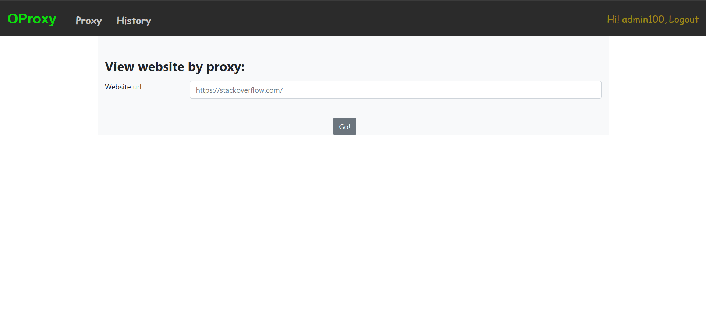
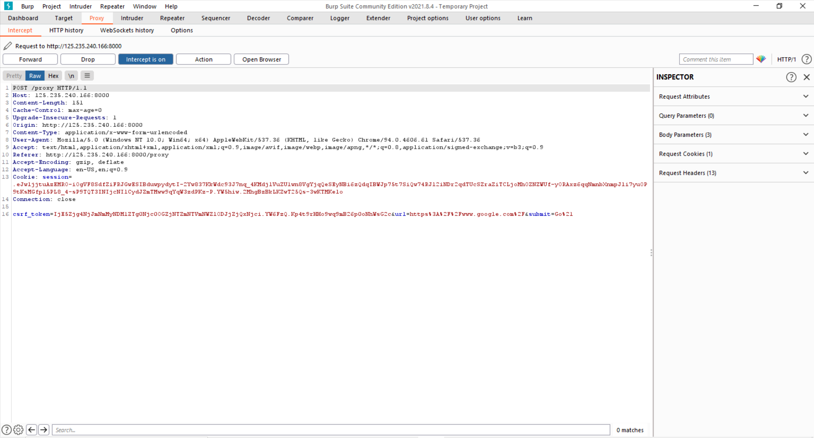
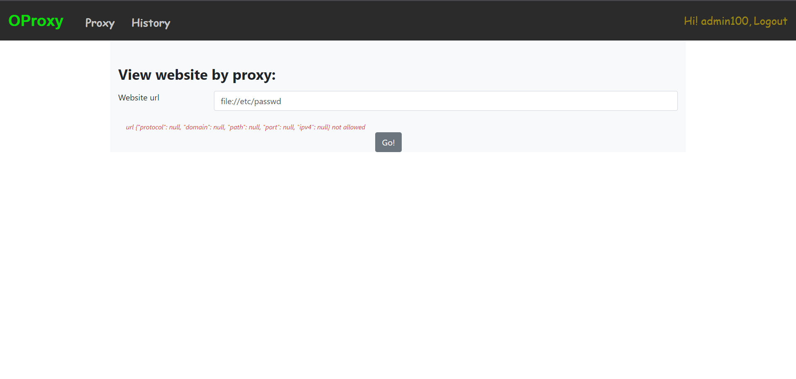
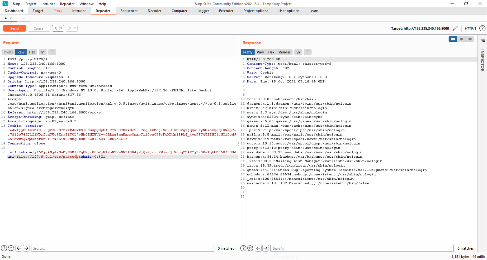
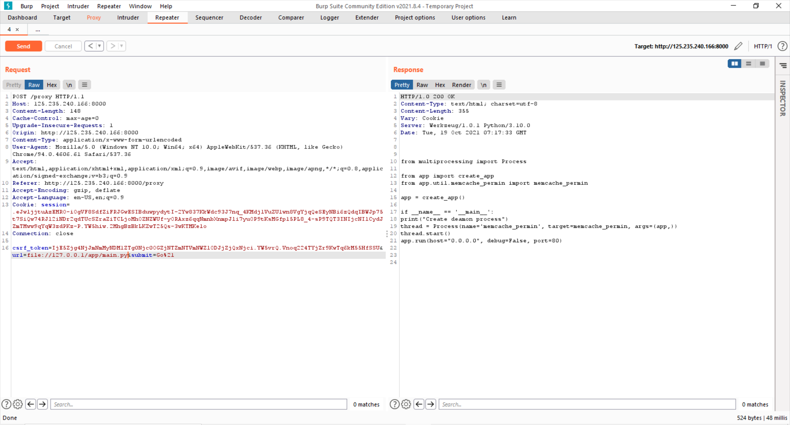
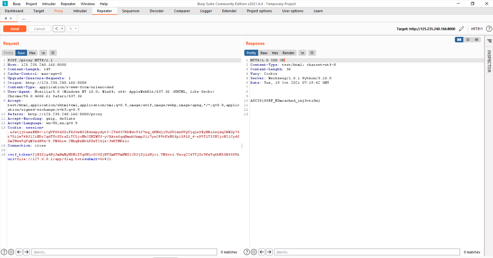

# ASCIS-CTF-2021-QUALS - 400pts
* Category: Web 
* Name: OProxy
* Level: None
* Description: None
## Solution
* Overview challenge provided a search box for user type a url and then the server response a content of webiste

* I usage Burp Suite catch a request of url i has typed and i think its `SSRF`

* Then i found some techniques attack `SSRF`, well i found fetching a local file, I try this payload `file://etc/passwd` its seems nothing.But i realized its wrong format url 
* SSRF techniques attack <https://beaglesecurity.com/blog/article/server-side-request-forgery-attack.html>

* So i added a `IP` `127.0.0.1` before `/etc/passwd`, `file://127.0.0.1/etc/passwd` and i found a system files 

* The challenge server response header `Werkzeug/1.0.1 Python/3.10.0`, Backend of website is `Flask`, I usage this payload `file://127.0.0.1/app/main.py`, well i found a source code
* <https://pypi.org/project/Werkzeug/>

* I usage payload `file://127.0.0.1/app/flag.txt` for read a flag. Finally i found a flag 

* FLAG `ASCIS{SSRF_M3mcached_inj3cti0n}`
